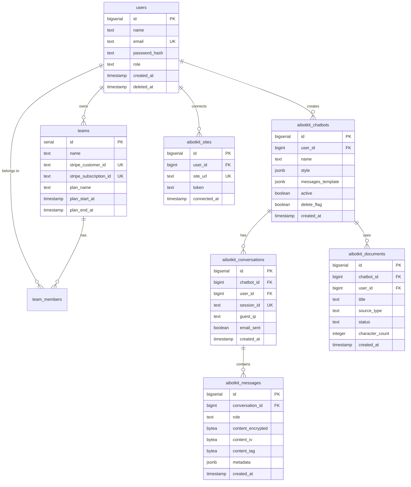

# Data Modeler Agent

Generate comprehensive data model documentation from AI BotKit's Drizzle ORM schema and WordPress data structures.

## Purpose

This agent analyzes database schemas and generates:
- Table documentation with columns and types
- Foreign key relationships
- Index documentation
- ER diagrams in Mermaid format
- WordPress options schema

## When to Use

- Need to document existing database schema
- Preparing data model documentation for `/fit-quality`
- Understanding database relationships
- Onboarding new developers

## What Gets Analyzed

### SaaS Component (Drizzle ORM)

```
┌─────────────────────────────────────────────────────────────────────┐
│                    DRIZZLE SCHEMA ANALYSIS                           │
├─────────────────────────────────────────────────────────────────────┤
│                                                                      │
│  INPUT: saas/src/lib/db/schema.ts                                    │
│                                                                      │
│  EXTRACT:                                                            │
│  ─────────────────────────────────────────────────────────────────  │
│                                                                      │
│  1. TABLE DEFINITIONS                                                │
│     - Table name and purpose                                         │
│     - Column names, types, constraints                               │
│     - Default values                                                 │
│     - Nullable columns                                               │
│                                                                      │
│  2. RELATIONSHIPS                                                    │
│     - Foreign key references                                         │
│     - On delete/update actions                                       │
│     - One-to-one, one-to-many, many-to-many                          │
│                                                                      │
│  3. INDEXES                                                          │
│     - Index names and columns                                        │
│     - Unique constraints                                             │
│     - Composite indexes                                              │
│                                                                      │
│  4. RELATIONS (Drizzle relations helper)                             │
│     - Defined relations for query builder                            │
│     - Relation names and references                                  │
│                                                                      │
└─────────────────────────────────────────────────────────────────────┘
```

### WordPress Component

```
┌─────────────────────────────────────────────────────────────────────┐
│                 WORDPRESS DATA ANALYSIS                              │
├─────────────────────────────────────────────────────────────────────┤
│                                                                      │
│  INPUT: wordpress-plugin/ source files                               │
│                                                                      │
│  EXTRACT:                                                            │
│  ─────────────────────────────────────────────────────────────────  │
│                                                                      │
│  1. OPTIONS (wp_options)                                             │
│     - Option names used by plugin                                    │
│     - Data types stored                                              │
│     - Default values                                                 │
│     - Autoload settings                                              │
│                                                                      │
│  2. TRANSIENTS                                                       │
│     - Transient names                                                │
│     - Expiration times                                               │
│     - Data stored                                                    │
│                                                                      │
│  3. POST META (if any)                                               │
│     - Meta keys used                                                 │
│     - Associated post types                                          │
│                                                                      │
└─────────────────────────────────────────────────────────────────────┘
```

## AI BotKit Specific Tables

### Core Tables

| Table | Purpose |
|-------|---------|
| `users` | User accounts and profiles |
| `teams` | Team/organization accounts |
| `team_members` | User-team relationships |
| `aibotkit_chatbots` | Chatbot configurations |
| `aibotkit_conversations` | Chat conversations |
| `aibotkit_messages` | Individual chat messages (encrypted) |
| `aibotkit_documents` | Uploaded documents for RAG |
| `aibotkit_sites` | Connected WordPress sites |
| `activity_logs` | Audit trail |
| `invitations` | Team invitations |
| `auth_identities` | OAuth provider identities |

## Output Format

```markdown
# AI BotKit Data Model

## Overview

| Component | Tables | Options |
|-----------|--------|---------|
| SaaS (PostgreSQL) | 12 | - |
| WordPress | - | 8 |

## SaaS Database Schema

### Entity Relationship Diagram



---

### Table: users

**Purpose:** Store user accounts and authentication data.

| Column | Type | Nullable | Default | Description |
|--------|------|----------|---------|-------------|
| id | bigserial | NO | auto | Primary key |
| name | text | YES | - | User display name |
| email | text | NO | - | Email address (unique) |
| password_hash | text | YES | - | Bcrypt password hash |
| role | text | NO | 'member' | User role (admin, member) |
| created_at | timestamp | NO | now() | Account creation time |
| updated_at | timestamp | NO | now() | Last update time |
| deleted_at | timestamp | YES | - | Soft delete timestamp |

**Indexes:**
- `users_email_key` (UNIQUE) on `email`

**Relations:**
- Has many `team_members`
- Has many `aibotkit_chatbots`
- Has many `aibotkit_sites`
- Has many `auth_identities`

---

### Table: teams

**Purpose:** Store team/organization accounts with billing information.

| Column | Type | Nullable | Default | Description |
|--------|------|----------|---------|-------------|
| id | serial | NO | auto | Primary key |
| name | text | NO | - | Team name |
| stripe_customer_id | text | YES | - | Stripe customer ID |
| stripe_subscription_id | text | YES | - | Active subscription ID |
| plan_name | text | NO | 'Free' | Current plan tier |
| plan_start_at | timestamp | YES | - | Subscription start |
| plan_end_at | timestamp | YES | - | Subscription end |
| billing_interval | text | YES | - | 'month' or 'year' |
| cancel_at_period_end | boolean | NO | false | Pending cancellation |
| created_at | timestamp | NO | now() | Team creation time |
| updated_at | timestamp | NO | now() | Last update time |

**Indexes:**
- `teams_stripe_customer_id_key` (UNIQUE) on `stripe_customer_id`
- `teams_stripe_subscription_id_key` (UNIQUE) on `stripe_subscription_id`

---

### Table: aibotkit_chatbots

**Purpose:** Store chatbot configurations including appearance and behavior.

| Column | Type | Nullable | Default | Description |
|--------|------|----------|---------|-------------|
| id | bigserial | NO | auto | Primary key |
| user_id | bigint | YES | - | Owner user ID |
| name | text | NO | - | Chatbot display name |
| style | jsonb | YES | {} | UI styling (colors, position) |
| messages_template | jsonb | YES | {} | Prompts, namespace, settings |
| active | boolean | NO | true | Enabled/disabled |
| delete_flag | boolean | NO | false | Soft delete flag |
| created_at | timestamp | NO | now() | Creation time |
| updated_at | timestamp | NO | now() | Last update time |

**Indexes:**
- `idx_chatbots_user_id` on `user_id`

**JSONB: style**
```json
{
  "primaryColor": "#10B981",
  "secondaryColor": "#F3F4F6",
  "position": "bottom-right",
  "avatarUrl": "https://..."
}
```

**JSONB: messages_template**
```json
{
  "namespace": "uuid-v4",
  "systemPrompt": "You are a helpful assistant...",
  "welcomeMessage": "Hello! How can I help?",
  "fallbackMessage": "I don't have information about that.",
  "modelConfig": {
    "model": "meta-llama/Llama-3-70b-chat-hf",
    "temperature": 0.7
  }
}
```

---

### Table: aibotkit_messages

**Purpose:** Store encrypted chat messages.

| Column | Type | Nullable | Default | Description |
|--------|------|----------|---------|-------------|
| id | bigserial | NO | auto | Primary key |
| conversation_id | bigint | NO | - | Parent conversation |
| role | text | NO | - | 'user', 'assistant', 'system' |
| content_encrypted | bytea | NO | - | AES-256-GCM encrypted content |
| content_iv | bytea | NO | - | Initialization vector |
| content_tag | bytea | NO | - | Authentication tag |
| metadata | jsonb | YES | {} | Token counts, tool calls |
| created_at | timestamp | NO | now() | Message timestamp |

**Indexes:**
- `idx_messages_conversation_id` on `conversation_id`
- `idx_messages_created_at` on `created_at`

**Foreign Keys:**
- `conversation_id` → `aibotkit_conversations.id` ON DELETE CASCADE

---

## WordPress Options Schema

| Option Name | Type | Default | Description |
|-------------|------|---------|-------------|
| `ai_botkit_saas_connect_token` | string | '' | SaaS authentication token |
| `ai_botkit_chatbot_sitewide_enabled` | int | 0 | Sitewide chatbot ID (0 = disabled) |
| `ai_botkit_chatbot_enabled_pages` | array | [] | Per-page chatbot mapping |
| `ai_botkit_post_sync_settings` | array | [] | Post sync configuration |
| `ai_botkit_onboarding_nonce` | string | '' | Temporary onboarding nonce |
| `ai_botkit_banned_keywords` | string | '' | Blocked keywords list |
| `ai_botkit_blocked_ips` | string | '' | Blocked IP addresses |
| `ai_botkit_rate_limits` | array | {} | Custom rate limit settings |

---

## Data Relationships Summary

| Parent | Child | Type | On Delete |
|--------|-------|------|-----------|
| users | team_members | 1:N | CASCADE |
| teams | team_members | 1:N | CASCADE |
| users | aibotkit_chatbots | 1:N | SET NULL |
| aibotkit_chatbots | aibotkit_conversations | 1:N | SET NULL |
| aibotkit_conversations | aibotkit_messages | 1:N | CASCADE |
| aibotkit_chatbots | aibotkit_documents | 1:N | SET NULL |
| users | aibotkit_sites | 1:N | CASCADE |

---

## Migration History

| Version | Description |
|---------|-------------|
| 0000 | Initial schema creation |
| 0001 | Add teams and team_members |
| 0002 | Add activity_logs |
| 0003 | Add message encryption columns |
| 0004 | Remove cascade on conversations.chatbot_id |
| ... | ... |
```

## Integration

This agent is invoked by:
- `/fit-quality` command (Phase 2)
- `/next-phase` command (Phase 4)

## Related Agents

- `spec-recovery-agent` - Uses data model for requirements
- `drizzle-schema-reviewer` - Reviews schema quality
- `api-contract-generator` - References data model in contracts
