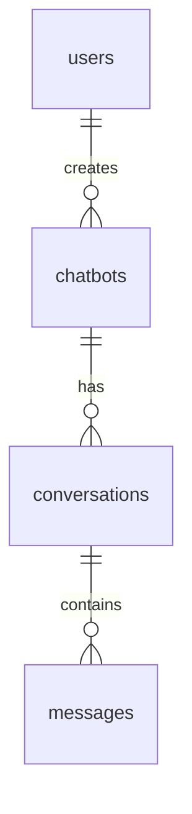

# Agents Reference

Complete reference for all AI BotKit Engineering Plugin agents.

## Overview

The plugin includes 28 specialized agents organized by category:

| Category | Agents | Purpose |
|----------|--------|---------|
| Review | 5 | Code standards, architecture, and fixes |
| AI | 1 | RAG and AI implementation |
| Database | 1 | Schema and query patterns |
| Security | 2 | Security auditing |
| WordPress | 3 | WordPress standards and hooks |
| Architecture | 1 | Codebase capability indexing |
| Orchestration | 9 | Workflow coordination and artifact generation |
| Testing | 5 | Test writing, execution, and bug fixing |
| Documentation | 1 | Documentation sync and validation |

---

## Review Agents

### nextjs-standards-reviewer

Reviews Next.js 16 App Router patterns and React best practices.

**What It Checks:**

| Area | Checks |
|------|--------|
| Server Components | Default to server, proper data fetching |
| Client Components | Minimal 'use client', proper boundaries |
| Data Fetching | Parallel fetches, React cache, no waterfalls |
| Route Handlers | Proper error handling, validation |
| Layouts | Proper nesting, loading states |
| Metadata | SEO, Open Graph, dynamic metadata |

**Example Findings:**

```markdown
### HIGH: Client Component with Database Access
**File:** src/app/(dashboard)/chatbots/page.tsx:15
**Issue:** Client component attempting direct database query

**Current:**
```tsx
'use client';
const chatbots = await db.query.chatbots.findMany(); // Wrong!
```

**Recommended:**
```tsx
// Remove 'use client' or fetch via API
async function ChatbotsPage() {
  const chatbots = await db.query.chatbots.findMany();
  return <ChatbotList chatbots={chatbots} />;
}
```
```

**When Invoked:**
- `/full-review` (always)
- `/full-review --component saas`
- `/next-phase 9` (Code Review phase)

---

### api-integration-reviewer

Reviews API consistency between SaaS application and WordPress plugin.

**What It Checks:**

| Area | Checks |
|------|--------|
| Endpoints | Matching routes, HTTP methods |
| Request/Response | Schema consistency, field names |
| Authentication | Token handling, header format |
| Error Handling | Error codes, message format |
| Versioning | API version compatibility |

**Example Findings:**

```markdown
### MEDIUM: Response Schema Mismatch
**SaaS Endpoint:** GET /api/chatbots/:id
**WordPress Call:** AI_BotKit_API::get_chatbot()

**SaaS Response:**
```json
{ "id": 1, "name": "Bot", "createdAt": "2024-01-15T..." }
```

**WordPress Expects:**
```json
{ "id": 1, "name": "Bot", "created_at": "2024-01-15T..." }
```

**Issue:** Field naming convention mismatch (camelCase vs snake_case)

**Recommendation:** Standardize on camelCase for API responses
```

**When Invoked:**
- `/full-review` (always)
- When changes affect API contracts

---

### accessibility-guardian

Reviews code for WCAG 2.1 AA accessibility compliance.

**What It Checks:**

| WCAG Principle | Checks |
|----------------|--------|
| Perceivable | Color contrast, alt text, captions |
| Operable | Keyboard navigation, focus management |
| Understandable | Labels, error messages, consistent nav |
| Robust | Semantic HTML, ARIA attributes |

**Specific Checks:**

- Color contrast ratios (4.5:1 for text, 3:1 for UI)
- Keyboard accessibility for all interactive elements
- Screen reader support (ARIA live regions, labels)
- Focus management (visible indicators, logical order)
- Form accessibility (labels, error identification)
- Motion preferences (prefers-reduced-motion)

**Example Findings:**

```markdown
### HIGH: Missing ARIA Live Region
**File:** src/components/ChatWidget/MessageList.tsx:25
**WCAG:** 4.1.3 Status Messages

**Current:**
```tsx
<div className="messages">
  {messages.map(m => <Message key={m.id} {...m} />)}
</div>
```

**Recommended:**
```tsx
<div
  className="messages"
  role="log"
  aria-live="polite"
  aria-label="Chat conversation"
>
  {messages.map(m => <Message key={m.id} {...m} />)}
</div>
```

**Impact:** Screen reader users not notified of new messages
```

**When Invoked:**
- `/full-review` (always)
- `/full-review --focus accessibility`
- When adding UI components

---

### architecture-reviewer

Reviews code architecture for maintainability, scalability, and design principles.

**What It Checks:**

| Principle | Checks |
|-----------|--------|
| Layer Separation | Presentation, Application, Infrastructure |
| SOLID | SRP, OCP, LSP, ISP, DIP |
| Coupling | Module dependencies, circular imports |
| Cohesion | Related code grouping |
| Scalability | Statelessness, caching, efficiency |
| Technical Debt | TODOs, code smells, complexity |

**Example Findings:**

```markdown
### MEDIUM: SRP Violation
**File:** src/lib/ai/rag-engine.ts
**Issue:** RagEngine class has too many responsibilities

**Current Responsibilities:**
1. Document chunking
2. Embedding generation
3. Vector search
4. Prompt construction
5. LLM completion
6. Response streaming

**Recommended Split:**
- `DocumentChunker` - Chunking logic
- `EmbeddingService` - Embedding generation
- `VectorSearchService` - Pinecone operations
- `PromptBuilder` - Prompt construction
- `RagEngine` - Orchestration only
```

**Architecture Diagram Generated:**

```
┌─────────────┐     ┌─────────────┐
│   API       │────►│   Domain    │
└─────────────┘     └─────────────┘
      │                   │
      │                   ▼
      │            ┌─────────────┐
      └───────────►│Infrastructure│
                   └─────────────┘

Circular Dependencies: 0 ✅
```

**When Invoked:**
- `/full-review` (always)
- `/full-review --focus architecture`
- `/next-phase 5` (Architecture phase)

---

## AI Agents

### rag-engine-reviewer

Reviews RAG (Retrieval-Augmented Generation) implementation for correctness and efficiency.

**What It Checks:**

| Area | Checks |
|------|--------|
| Document Processing | Chunk size, overlap, metadata |
| Embeddings | Model selection, batching, caching |
| Vector Search | Namespace isolation, scoring, filtering |
| Prompt Engineering | Context injection, token budgets |
| Generation | Streaming, error handling, fallbacks |
| Performance | Latency, caching, batch operations |

**Example Findings:**

```markdown
### HIGH: Missing Score Threshold
**File:** src/lib/ai/rag-engine.ts:89
**Issue:** Vector search returns all results without relevance filtering

**Current:**
```typescript
const results = await pinecone.query({
  vector: embedding,
  topK: 10,
});
return results.matches; // All 10 returned
```

**Recommended:**
```typescript
const SCORE_THRESHOLD = 0.7;
const results = await pinecone.query({
  vector: embedding,
  topK: 10,
});
return results.matches.filter(m => m.score >= SCORE_THRESHOLD);
```

**Impact:** Low-relevance context pollutes prompts, degrading response quality
```

**Metrics Evaluated:**

| Metric | Target | Alert |
|--------|--------|-------|
| Search Latency | <200ms | >500ms |
| Generation Latency | <2s | >5s |
| Relevance Score | >0.75 | <0.6 |
| Fallback Rate | <10% | >25% |

**When Invoked:**
- `/full-review` (always)
- `/test-rag`
- `/full-review --focus rag`

---

## Database Agents

### drizzle-schema-reviewer

Reviews Drizzle ORM schema design, queries, and migrations.

**What It Checks:**

| Area | Checks |
|------|--------|
| Schema Design | Types, constraints, defaults |
| Relationships | Foreign keys, relations config |
| Indexes | Foreign key indexes, query optimization |
| Queries | N+1 prevention, efficient patterns |
| Migrations | Safety, backward compatibility |
| Types | Proper TypeScript inference |

**Example Findings:**

```markdown
### MEDIUM: Missing Index on Foreign Key
**File:** src/lib/db/schema.ts:45
**Table:** aibotkit_documents

**Current:**
```typescript
export const documents = pgTable('aibotkit_documents', {
  chatbotId: integer('chatbot_id').references(() => chatbots.id),
  // No index defined
});
```

**Recommended:**
```typescript
export const documents = pgTable('aibotkit_documents', {
  chatbotId: integer('chatbot_id').references(() => chatbots.id),
}, (table) => ({
  chatbotIdIdx: index('idx_documents_chatbot_id').on(table.chatbotId),
}));
```

**Impact:** Slow queries when filtering documents by chatbot
```

**Query Analysis:**

```markdown
### N+1 Query Detected
**File:** src/app/api/chatbots/route.ts:25

**Current Pattern:**
```typescript
const chatbots = await db.select().from(chatbotsTable);
for (const chatbot of chatbots) {
  chatbot.documents = await db.select().from(documents)
    .where(eq(documents.chatbotId, chatbot.id));
}
```

**Recommended:**
```typescript
const chatbots = await db.query.chatbots.findMany({
  with: { documents: true },
});
```
```

**When Invoked:**
- `/full-review` (always)
- `/sync-db`
- When schema changes

---

## Security Agents

### saas-security-auditor

Audits SaaS application for security vulnerabilities.

**What It Checks:**

| Category | Checks |
|----------|--------|
| Authentication | Session management, JWT security |
| Authorization | Route protection, resource access |
| Input Validation | Zod schemas, sanitization |
| XSS Prevention | Output encoding, CSP |
| CSRF Protection | Token validation, SameSite cookies |
| API Security | Rate limiting, authentication |
| Secrets | Environment variables, no hardcoding |

**Example Findings:**

```markdown
### CRITICAL: SQL Injection Vulnerability
**File:** src/app/api/chatbots/search/route.ts:18
**Issue:** User input directly interpolated in query

**Current:**
```typescript
const results = await db.execute(
  sql`SELECT * FROM chatbots WHERE name LIKE '%${query}%'`
);
```

**Recommended:**
```typescript
const results = await db
  .select()
  .from(chatbots)
  .where(like(chatbots.name, `%${query}%`));
```
```

**Security Checklist:**

```markdown
## Security Audit Results

| Check | Status | Notes |
|-------|--------|-------|
| JWT secret rotation | ✅ | Using AUTH_SECRET |
| Session expiration | ✅ | 7 day expiry |
| HTTPS only cookies | ✅ | In production |
| Input validation | ⚠️ | Missing on 2 endpoints |
| Rate limiting | ❌ | Not implemented |
| CSP headers | ⚠️ | Partial implementation |
```

**When Invoked:**
- `/full-review` (always)
- `/full-review --focus security`
- Before production deployments

---

### stripe-integration-reviewer

Reviews Stripe payment integration for security and best practices.

**What It Checks:**

| Area | Checks |
|------|--------|
| Webhook Security | Signature verification |
| API Keys | Environment variables, no exposure |
| Checkout Flow | Session creation, success/cancel URLs |
| Subscription Management | Status handling, cancellation |
| Error Handling | Graceful failures, logging |
| PCI Compliance | No card data handling |

**Example Findings:**

```markdown
### HIGH: Missing Webhook Signature Verification
**File:** src/app/api/stripe/webhook/route.ts:12

**Current:**
```typescript
export async function POST(request: NextRequest) {
  const body = await request.json(); // Wrong!
  // Processing without verification
}
```

**Recommended:**
```typescript
export async function POST(request: NextRequest) {
  const body = await request.text();
  const signature = request.headers.get('stripe-signature')!;

  const event = stripe.webhooks.constructEvent(
    body,
    signature,
    process.env.STRIPE_WEBHOOK_SECRET!
  );
  // Now safe to process
}
```
```

**When Invoked:**
- `/full-review` (always)
- `/full-review --focus payments`
- When modifying payment flows

---

## WordPress Agents

### wordpress-standards-reviewer

Reviews WordPress plugin code for WPCS compliance and best practices.

**What It Checks:**

| Area | Checks |
|------|--------|
| Coding Standards | WPCS compliance |
| Hooks | Proper action/filter usage |
| Database | $wpdb usage, prepared statements |
| Internationalization | Text domain, __(), _e() |
| Enqueuing | Proper script/style registration |
| Options | Options API usage |

**Example Findings:**

```markdown
### MEDIUM: Missing Text Domain
**File:** wordpress-plugin/admin/class-admin.php:45

**Current:**
```php
echo '<h1>Settings</h1>';
```

**Recommended:**
```php
echo '<h1>' . esc_html__('Settings', 'ai-botkit') . '</h1>';
```
```

**When Invoked:**
- `/full-review` (always)
- `/full-review --component wordpress`

---

### wordpress-security-auditor

Audits WordPress plugin for security vulnerabilities.

**What It Checks:**

| Category | Checks |
|----------|--------|
| SQL Injection | $wpdb->prepare() usage |
| XSS | Output escaping (esc_html, esc_attr) |
| CSRF | Nonce verification |
| Capabilities | current_user_can() checks |
| File Operations | Path validation |
| Input Validation | Sanitization functions |

**Example Findings:**

```markdown
### CRITICAL: SQL Injection
**File:** wordpress-plugin/includes/class-chatbot.php:78

**Current:**
```php
$wpdb->query("DELETE FROM {$table} WHERE id = {$_GET['id']}");
```

**Recommended:**
```php
$wpdb->query($wpdb->prepare(
  "DELETE FROM {$table} WHERE id = %d",
  absint($_GET['id'])
));
```
```

**When Invoked:**
- `/full-review` (always)
- `/full-review --component wordpress --focus security`

---

## Orchestration Agents

### gap-analyzer

Compares current codebase capabilities against requirements to identify gaps.

**What It Analyzes:**

| Input | Analysis |
|-------|----------|
| Requirements doc | Extract required features |
| DISCOVERY_REPORT.md | Extract current capabilities |
| Source code | Verify implementation exists |

**Output:** `reports/GAP_ANALYSIS.md` with coverage metrics and missing features.

**When Invoked:**
- `/next-phase 0.3` (Gap Analysis phase)
- Manual gap analysis requests

---

### requirements-spec-validator

Validates that specifications cover all requirements (quality gate).

**What It Checks:**

| Check | Criteria |
|-------|----------|
| Coverage | Every FR/NFR has matching spec section |
| Traceability | Specs reference requirement IDs |
| Completeness | No orphaned requirements |

**Output:** `reports/REQ_SPEC_VALIDATION.md` with pass/fail status.

**When Invoked:**
- `/next-phase 5.6` (Quality gate before coding)

---

### test-case-generator

Generates manual test cases from specifications.

**What It Generates:**

- User acceptance test scenarios
- Edge case test scenarios
- Regression test cases
- Test data requirements

**Output:** `tests/TEST_CASES.md`, `tests/REGRESSION_TEST_CASES.md`

**When Invoked:**
- `/next-phase 5.7` (Test case generation phase)

---

### spec-recovery-agent

Reverse-engineers specifications from existing code for undocumented projects.

**What It Analyzes:**

| Source | Extracted |
|--------|-----------|
| API routes | Endpoint documentation, request/response schemas |
| Database schema | Data model, relationships |
| UI components | User-facing features |
| Business logic | Functional requirements |
| Config/env | Non-functional requirements |

**Output:** `specs/RECOVERED_SPECIFICATION.md` with FR-xxx and NFR-xxx requirements.

**Example Output:**
```markdown
### FR-001: Chat Messaging
**Source:** src/app/api/chat/route.ts
- Users can send messages to chatbots
- Responses stream via Server-Sent Events
- Rate limited per plan tier
```

**When Invoked:**
- `/fit-quality` (Phase 3)

---

### data-modeler

Generates data model documentation from Drizzle ORM schema and WordPress data structures.

**What It Analyzes:**

| Source | Output |
|--------|--------|
| Drizzle schema.ts | Table documentation, ER diagrams |
| Relations config | Relationship documentation |
| WordPress options | Options schema documentation |
| Indexes | Index documentation |

**Output:** ER diagrams in Mermaid format, table documentation, relationship maps.

**Example Output:**


**When Invoked:**
- `/fit-quality` (Phase 4)
- `/next-phase 4` (Architecture phase)

---

### api-contract-generator

Generates API contract documentation from Next.js route handlers and WordPress REST endpoints.

**What It Extracts:**

| Source | Documentation |
|--------|--------------|
| Route handlers | HTTP methods, paths, parameters |
| Zod schemas | Request/response validation |
| Auth middleware | Authentication requirements |
| Rate limiters | Rate limiting rules |

**Output:** `specs/contracts/*.md` with OpenAPI-style documentation.

**Example Output:**
```markdown
### POST /api/chat

**Authentication:** Optional (supports guest users)

**Request:**
```typescript
interface ChatRequest {
  chatbotId: string;
  message: string;
  conversationId?: string;
}
```

**Response:** Server-Sent Events stream
```

**When Invoked:**
- `/fit-quality` (Phase 4)

---

### documentation-generator

Generates comprehensive user and developer documentation.

**What It Generates:**

| Document | Content |
|----------|---------|
| README.md | Project overview, quick start |
| USER_GUIDE.md | End-user documentation |
| DEVELOPER.md | Developer setup, architecture |
| CONFIGURATION.md | Environment variables, settings |
| CONTRIBUTING.md | Contribution guidelines |

**When Invoked:**
- `/fit-quality` (Phases 5-6)
- `/update-docs`

---

### manual-test-generator

Generates comprehensive manual test scenarios for QA testers.

**What It Generates:**

| Category | Tests |
|----------|-------|
| User Journeys | End-to-end workflow tests |
| Feature Tests | Individual feature verification |
| Integration Tests | Cross-system scenarios |
| Accessibility Tests | WCAG 2.1 AA compliance |
| Security Tests | Manual security verification |
| Performance Tests | User-perceived performance |

**Output:** `tests/manual/MANUAL_TEST_CASES.md` with prioritized test cases.

**Example Output:**
```markdown
### UJ-001: New User Signup to First Chat

**Priority:** P0 (Critical)
**Estimated Time:** 10 minutes

| Step | Action | Expected Result |
|------|--------|-----------------|
| 1 | Navigate to signup | Signup form displays |
| 2 | Enter credentials | Form accepts input |
| 3 | Click "Create Account" | Redirect to dashboard |
```

**When Invoked:**
- `/fit-quality` (Phase 7)

---

### api-docs-generator

Generates detailed API reference documentation with SDK examples.

**What It Generates:**

| Document | Content |
|----------|---------|
| docs/API.md | Complete API reference |
| docs/RAG_ENGINE.md | RAG internals documentation |
| docs/DATABASE.md | Database documentation |
| docs/WORDPRESS_HOOKS.md | WordPress hooks reference |

**SDK Examples Generated:**
- JavaScript/TypeScript
- Python
- cURL

**When Invoked:**
- `/fit-quality` (Phase 6)

---

## Testing Agents

### unit-test-writer

Writes Vitest unit tests with proper mocking for Drizzle, Stripe, and Pinecone.

**When Invoked:**
- `/next-phase 7` (Testing phase)
- `/fit-quality` (Phase 8)

---

### e2e-test-generator

Generates Playwright E2E tests for user flows.

**When Invoked:**
- `/next-phase 7` (Testing phase)
- `/fit-quality` (Phase 8)

---

### integration-test-specialist

Writes integration tests for API, database, and external services.

**When Invoked:**
- `/next-phase 7` (Testing phase)

---

### e2e-test-runner

Executes tests, parses failures, and coordinates fixes.

**When Invoked:**
- `/next-phase 8` (Test & Fix loop)

---

### bug-fixer

Analyzes test failures and implements fixes.

**When Invoked:**
- `/next-phase 8` (Test & Fix loop)

---

## Documentation Agents

### documentation-updater

Synchronizes GitBook documentation with SaaS and WordPress codebases to keep docs accurate.

**What It Checks:**

| Area | Checks |
|------|--------|
| Plan Limits | Sync from `checkRateLimit.ts` to docs |
| Features | Sync from code to feature lists |
| Links | Validate all internal markdown links |
| Images | Verify `.gitbook/assets/` references |
| Structure | SUMMARY.md matches file structure |

**Data Sources:**

| Source | Data Extracted |
|--------|---------------|
| `saas/src/lib/checkRateLimit.ts` | Plan limits (chatbots, messages, storage) |
| `saas/docs/plan-limits.md` | Plan descriptions |
| `wordpress-plugin/readme.txt` | Plugin features |
| `saas/src/app/api/` | API endpoints |

**Example Findings:**

```markdown
### HIGH: Plan Limit Mismatch
**File:** documentation/plans-and-billing/upgrading-to-paid-plans.md:15
**Issue:** Basic plan messages incorrect

**Current (in docs):**
```
* **Basic** → 3 chatbots, 300 messages/month
```

**Expected (from code):**
```
* **Basic** → 3 chatbots, 500 messages/month
```

**Source:** saas/src/lib/checkRateLimit.ts:8
```

**Validation Report:**

```markdown
## Documentation Validation

### Link Check
- ✅ 45 internal links valid
- ❌ 0 broken links

### Image Check
- ✅ 102 images valid
- ⚠️ 0 missing images

### Structure Check
- ✅ SUMMARY.md matches directory structure
- ✅ 29/29 files listed
```

**When Invoked:**
- `/update-docs` (always)
- `/update-docs --validate`
- `/next-phase 11` (Documentation phase)

---

## Agent Invocation

### Automatic (via Commands)

```bash
# Full review invokes all agents
/full-review

# Component-specific
/full-review --component saas    # SaaS agents only
/full-review --component wordpress  # WordPress agents only
```

### Manual Reference

When working on specific areas, Claude Code will automatically reference relevant agents:

```bash
# Working on RAG code
> Help me optimize the vector search

# Claude automatically uses rag-engine-reviewer patterns
```

## See Also

- [Commands Reference](COMMANDS.md)
- [Skills Reference](SKILLS.md)
- [Workflow Examples](WORKFLOWS.md)
